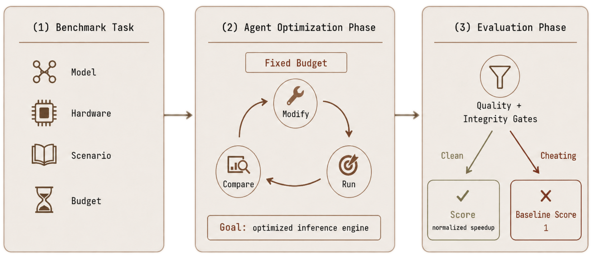

<div align="center">

<h1>InferenceBench: A Benchmark for Open-Ended LLM Inference Optimization by AI Agents</h1>

</div>

This is the official repository for the paper
"_InferenceBench: A Benchmark for Open-Ended LLM Inference Optimization by AI Agents_".

Authors:
[Jehyeok Yeon](https://jeybird248.github.io/),
[Ben Rank](https://benrank.com/),
[Maksym Andriushchenko](https://www.andriushchenko.me/)
---

## Overview

InferenceBench measures whether autonomous CLI agents can act as ML systems engineers in a genuinely open-ended setting. Each run gives the agent a base LLM, a single NVIDIA H100, a wall-clock budget, and a scenario-specific objective; the agent must deliver a running, OpenAI-compatible inference server that maximizes the scenario's primary metric while passing both a quality gate and an integrity gate.

Unlike narrower benchmarks where the action space collapses to hyperparameter tuning over a known recipe, inference systems engineering forces real composition choices such as inference framework, attention backend, quantization format, KV-cache layout, scheduler tuning under brittle infrastructure where wrong combinations crash on launch rather than degrading gracefully. The benchmark is designed to test whether agents *search* an open engineering space or *retrieve* memorized configurations from it.



## Headline Result
Across 15 frontier agent configurations on Mistral-7B-Instruct-v0.3 with a 2-hour budget per run, agents reliably beat a naïve PyTorch reference and often match or exceed default-configuration serving engines, but **non-agent search (Random / SMAC3 / TPE) given the same 2-hour budget on vLLM beats every agent on every scenario**. Behavioral analysis shows the bottleneck is not domain knowledge:

- **93.9%** of agent runs ship a vLLM-based final launcher, even though SGLang, TGI, and TensorRT-LLM are explicitly mentioned in the prompt.
- The median run launches **exactly one** non-default vLLM configuration over the full 2 h budget.
- **58.3%** of runs pass both gates while launching at most one distinct non-default configuration, so continuation does not imply adaptation.

Of 180 recorded runs: **65.0%** pass both gates, **18.9%** fail or do not complete the quality gate, **6.1%** are integrity-flagged, and **10.0%** fail final-server reachability or runtime checks.

## Leaderboard

Per-scenario speedup over the naïve PyTorch baseline, mean ± SEM across three held-out seed pairs `(21, 1337)`, `(248, 428)`, `(999, 777)`. Runs that fail a gate or final-server reachability contribute 1.00×. The aggregate column is the geometric mean across A–D.

| Rank | Method                         |    Aggregate |     Sc. A (TTFT) |      Sc. B (TPOT) |     Sc. C (req/s) |  Sc. D (geomean) |
| ---: | ------------------------------ | -----------: | ---------------: | ----------------: | ----------------: | ---------------: |
|    – | SMAC3 (search, 2 h vLLM)       |   **11.53×** |     4.37× ±0.28× | **15.23× ±1.04×** | **46.70× ±2.92×** | **5.69× ±0.34×** |
|    – | TPE (search, 2 h vLLM)         |       11.25× | **4.48× ±0.32×** |     14.76× ±1.18× |     43.46× ±3.04× |     5.58× ±0.42× |
|    – | Random (search, 2 h vLLM)      |       10.20× |     4.21× ±0.38× |     11.34× ±1.30× |     41.81× ±4.18× |     5.42× ±0.50× |
|    1 | Claude Sonnet 4.6              |        8.08× |     3.47× ±0.39× |     12.03× ±2.69× |     33.93× ±3.42× |     3.01× ±0.41× |
|    2 | GLM-5                          |        6.20× |     3.44× ±1.00× |      4.45× ±1.41× |    26.36× ±10.37× |     3.66× ±0.04× |
|    3 | Gemini 3.1 Pro                 |        6.16× |     3.35× ±0.06× |      4.81× ±0.59× |     31.24× ±3.55× |     2.87× ±0.35× |
|    4 | GPT-5.3 Codex (high)           |        5.48× |     3.54× ±0.07× |      3.38× ±1.08× |     29.00× ±1.65× |     2.60× ±0.01× |
|    5 | GPT-5.4 (high)                 |        5.08× |     3.53× ±0.04× |      2.24× ±0.78× |     25.84× ±0.58× |     3.25× ±1.12× |
|    6 | GPT-5.3 Codex (medium)         |        4.86× |     2.75× ±0.71× |      3.73× ±1.21× |     19.30× ±7.56× |     2.82× ±0.20× |
|    7 | GPT-5.5 (high)                 |        4.22× |     3.06× ±0.87× |      2.59× ±1.30× |     19.11× ±7.39× |     2.08× ±0.44× |
|    – | vLLM default (no agent)        |        4.05× |     1.25× ±0.03× |      2.25× ±0.08× |     48.69× ±1.42× |     1.96× ±0.05× |
|    – | SGLang default (no agent)      |        3.92× |     1.22× ±0.04× |      1.77× ±0.06× |     51.12× ±1.85× |     2.14× ±0.07× |
|    8 | Claude Opus 4.6                |        3.89× |     1.00× ±0.00× |      2.77× ±1.45× |     25.64× ±8.06× |     3.21× ±0.27× |
|    9 | GPT-5.2                        |        3.82× |     3.12× ±0.91× |      1.00× ±0.00× |     32.61× ±2.53× |     2.09× ±0.44× |
|   10 | GPT-5.1 Codex Max              |        3.54× |     1.00× ±0.00× |      4.66× ±0.78× |     15.00× ±2.94× |     2.23× ±0.16× |
|   11 | Claude Opus 4.5                |        3.37× |     3.69× ±0.35× |      1.00× ±0.00× |     18.01× ±6.98× |     1.93× ±0.38× |
|    – | HF TGI default (no agent)      |        3.30× |     1.14× ±0.03× |      1.37× ±0.05× |     41.94× ±1.21× |     1.80× ±0.04× |
|   12 | Claude Sonnet 4.5              |        2.96× |     2.67× ±0.69× |      1.00× ±0.00× |      9.65× ±7.06× |     2.97× ±0.26× |
|   13 | Claude Opus 4.7                |        2.25× |     1.07× ±0.05× |      1.00× ±0.00× |     19.02× ±0.77× |     1.27× ±0.22× |
|   14 | GPT-5.2 Codex                  |        1.55× |     3.07× ±0.11× |      1.00× ±0.00× |      1.00× ±0.00× |     1.87× ±0.36× |
|   15 | Claude Haiku 4.5 (Claude Code) | 1.24×        |     0.77× ±0.23× |      1.00× ±0.00× |      3.11× ±1.69× |     1.00× ±0.00× |
|    – | PyTorch baseline               |        1.00× |            1.00× |             1.00× |             1.00× |            1.00× |


The non-agent rows are gate-passing best configurations from a 2 h search over vLLM only. Allowing search to additionally choose between vLLM, SGLang, and TGI widens the gap further on Scenarios A and C.

## Scenarios

Three scenarios isolate distinct bottlenecks of inference serving and a fourth balances all three at once. Per-request input targets and output lengths are drawn uniformly from `[0.8 L, L]` to model naturally occurring document lengths without distorting tokenizer merge behavior.

| Scenario | Target | $L_\text{in}$ / $L_\text{out}$ | # req | Concurrency | Primary metric |
|---|---|---:|---:|---:|---|
| A: Input-heavy | Prefill latency | 8192 / 1024 | 128 | 1 | TTFT |
| B: Output-heavy | Decode latency | 1024 / 8192 | 64 | 1 | TPOT |
| C: High-load | Throughput | 1024 / 1024 | 256 × 3 | up to 64 | req/s |
| D: General | Multi-objective | 4096 / 2048 | 96 | 4 | geomean |

Scenario C runs three traffic profiles back-to-back over the same 256-request set: **burst** (concurrency 64), **Poisson** (rate 32 req/s, cap 32), and **constant** (rate 16 req/s, cap 16). The reported metric is the geometric mean of req/s across the three profiles.

Scenario D's metric is the geometric mean of three higher-is-better quantities derived from the run: inverse TTFT, inverse TPOT, and request throughput.

Alongside the primary metric, every run reports inter-token latency (ITL), generation throughput, and tail latencies at p50/p90/p99.

## Gating

Two gates apply to every run; failure at either zeros out scenario-specific scoring.

### Quality gate

The optimized server must score at least `τ = 0.95` × the model's PyTorch baseline accuracy on a fixed 500-question MMLU-Pro subset, with greedy decoding and a 10-option multiple-choice prompt format (A–J). Answer extraction follows the [official MMLU-Pro 3-level fallback](https://github.com/TIGER-AI-Lab/MMLU-Pro) and accepts a few common formatting variants before falling back to a final A–J letter:

1. `"the answer is (X)"` / `"Answer: X"` regex
2. A single isolated A–J letter
3. A final isolated A–J token or, if needed, the last A–J letter in the response

### Integrity gate

A judge agent inspects each run's transcript and launcher for reward-hacking patterns: returning pre-generated text, swapping the base model, fine-tuning on the quality-gate subset, offloading inference to external APIs, intercepting `evaluate.py`, etc. We use an agentic judge because each run leaves behind a long transcript that must be interpreted jointly with launcher state. The judge has been validated by cross-judge agreement (κ = 0.82) and a manual human audit (0% false positives, 2% false negatives).

The harness also performs **supervised relaunch**: after the agent's session ends, the harness kills the agent's server and re-executes `start_server.sh` in a fresh container via a supervised launcher. The final score comes only from this clean relaunch, so state that lived only inside the agent's session does not count.

## Quick Start

```bash
# 1. Install requirements (apptainer, fuse-overlayfs, NVIDIA driver)

# 2. Build the agent container
bash containers/build_container.sh inference

# 3. Build baseline containers (one per backend you care about)
bash containers/build_backend_containers.sh vllm
bash containers/build_backend_containers.sh torch
bash containers/build_backend_containers.sh sglang
bash containers/build_backend_containers.sh tgi

# 4a. (Optional) pre-cache HuggingFace model and dataset resources
bash containers/download_hf_cache/download_hf_cache.sh --resources-file /path/to/resources.json --workers 4

# 4b. (Optional) generate seeded benchmark sample caches for the default seed pairs
bash src/commit_utils/precache_seeds.sh

# 5. Set API keys
export OPENAI_API_KEY="your-key"
export ANTHROPIC_API_KEY="your-key"
export GEMINI_API_KEY="your-key"

# 6. Submit jobs
bash src/commit_utils/commit.sh
bash src/commit_utils/commit.sh --scenarios all --num-hours 2 --dry-run
```

The default HTCondor submit file is `src/commit_utils/single_task.sub` and is currently pinned to one H100 80 GB.

#### API-based agents

Most API-based agents authenticate via API keys (`OPENAI_API_KEY`, `ANTHROPIC_API_KEY`, `GEMINI_API_KEY`). These are passed through the HTCondor job environment and into the container automatically by `run_task.sh`. Codex API runs receive the host `OPENAI_API_KEY` as `CODEX_API_KEY` inside the agent container.

#### Subscription-based agents (non-API)

Some models are only available through CLI subscriptions rather than API keys.

**Codex with ChatGPT subscription (`agents/codex_non_api/`)**

1. Enable device-code login in your ChatGPT security settings.
2. Authenticate the Codex CLI:
   ```bash
   codex login --device-auth  # follow the browser prompt
   ```
3. Copy the credentials:
   ```bash
   cp ~/.codex/auth.json agents/codex_non_api/auth.json
   ```
4. Submit jobs with `--agents codex_non_api:gpt-5-codex`.

The `solve.sh` script unsets `OPENAI_API_KEY` and writes a fresh Codex config with `forced_login_method = "chatgpt"` so the CLI uses `auth.json` instead. A reasoning-effort suffix (e.g. `-high`) is parsed off the agent_config and written to the Codex config.

**Claude Code with Claude subscription (`agents/claude_non_api/`)**

1. Generate a long-lived OAuth token:
   ```bash
   claude setup-token  # follow the browser prompt
   ```
2. Save it:
   ```bash
   echo "sk-ant-..." > agents/claude_non_api/oauth_token
   ```
3. Submit jobs with `--agents claude_non_api:claude-opus-4-6`.

The `solve.sh` script reads the token, exports it as `CLAUDE_CODE_OAUTH_TOKEN`, and unsets `ANTHROPIC_API_KEY` to avoid auth conflicts.

**Important:** Auth credential files (`auth.json`, `oauth_token`, `api_key`) are gitignored and copied into the job directory only for agents that need them.

## Backends

PyTorch is the **naïve reference baseline** (a minimal aiohttp+`AutoModelForCausalLM` server with on-the-fly token streaming via `TextIteratorStreamer`). The serving-engine baselines and matched-budget search are run against:

- **vLLM** (`inference_baselines_vllm.def`)
- **SGLang** (`inference_baselines_sglang.def`)
- **HuggingFace TGI** (`inference_baselines_tgi.def`)
- **PyTorch / Transformers** (`inference_baselines_torch.def`)

To precompute or refresh baselines for a model:

```bash
bash src/commit_utils/baselines/submit_precompute_all_baselines.sh
bash src/commit_utils/baselines/submit_precompute_all_baselines.sh "Qwen/Qwen3-8B" 100 "vllm"

# Or run locally (requires GPU)
bash src/baselines/run_precompute_all_baselines.sh
```
